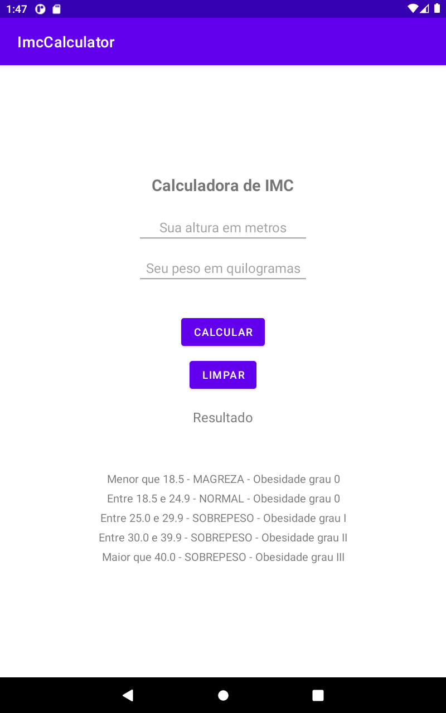
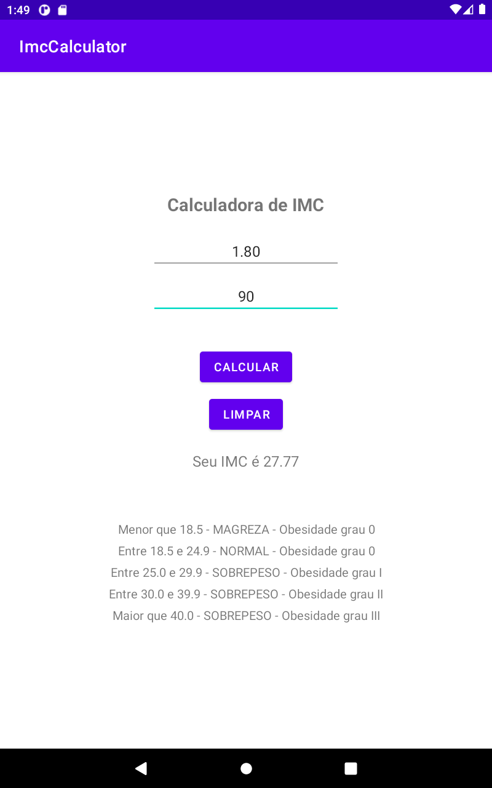
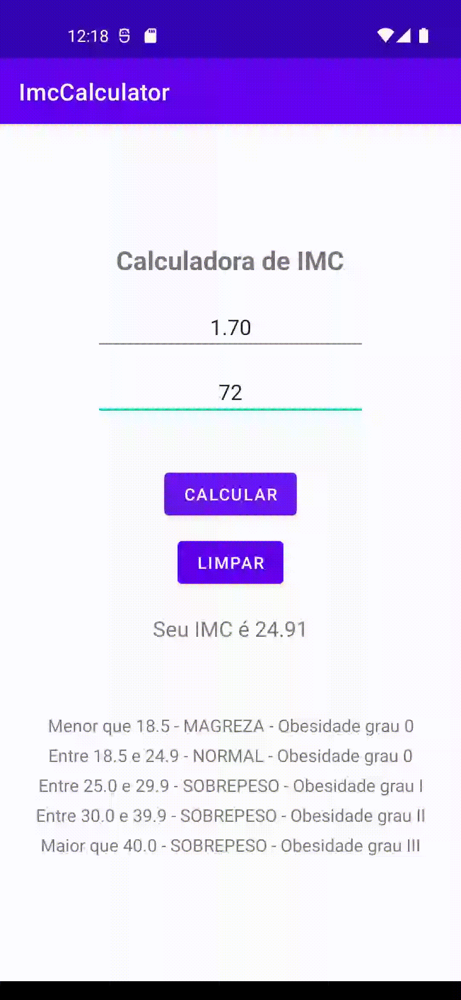

<h1 align="center">ImcCalculator</h1>

<p align="center">
  <a href="https://opensource.org/licenses/Apache-2.0"></a>
  <a href="https://android-arsenal.com/api?level=21"></a>
  <br>
  <a href="https://wa.me/+5511986726064"></a>
  <a href="https://www.linkedin.com/in/jhonybguerra/"></a>
  <a href="mailto:jhonybguerra@gmail.com"></a>
</p>

<p align="center">  

⭐ Esse é um projeto para demonstrar meu conhecimento técnico no desenvolvimento Android nativo com Kotlin. Mais informações técnicas abaixo.

💪 Aplicativo que realiza o cálculo do Índice de Massa Corporal (IMC).

</p>

</br>

<p float="left" align="center">


</p>

## Download
<a href='https://play.google.com/store/apps/details?id=com.jbgcomposer.imccalculator&pcampaignid=pcampaignidMKT-Other-global-all-co-prtnr-py-PartBadge-Mar2515-1'></a>

Ou faça o download da <a href="apk/app-debug.apk?raw=true">APK diretamente</a>. Você pode ver <a href="https://www.google.com/search?q=como+instalar+um+apk+no+android">aqui</a> como instalar uma APK no seu aparelho android.

## Tecnologias usadas e bibliotecas de código aberto

- Minimum SDK level: 21
- [Linguagem Kotlin](https://kotlinlang.org/)
- Custom Views: View customizadas usando XML.

- Jetpack
  - Lifecycle: Observa os ciclos de vida do Android e manipula os estados da interface do usuário após as alterações do ciclo de vida.
  - ViewBinding: Liga os componentes do XML no Kotlin através de uma classe que garante segurança de tipo e outras vantagens.

- Arquitetura
  - Single Activity

## Features

### Cálculo do IMC


O usuário insere os dados solicitados e o aplicativo retorna o valor do IMC, para que o usuário compare com a tabela apresentada logo abaixo do resultado.

# Licença

```xml
Copyright [2023] [Jhony Bossolane Guerra]

   Licensed under the Apache License, Version 2.0 (the "License");
   you may not use this file except in compliance with the License.
   You may obtain a copy of the License at

     http://www.apache.org/licenses/LICENSE-2.0

   Unless required by applicable law or agreed to in writing, software
   distributed under the License is distributed on an "AS IS" BASIS,
   WITHOUT WARRANTIES OR CONDITIONS OF ANY KIND, either express or implied.
   See the License for the specific language governing permissions and
   limitations under the License.

```
